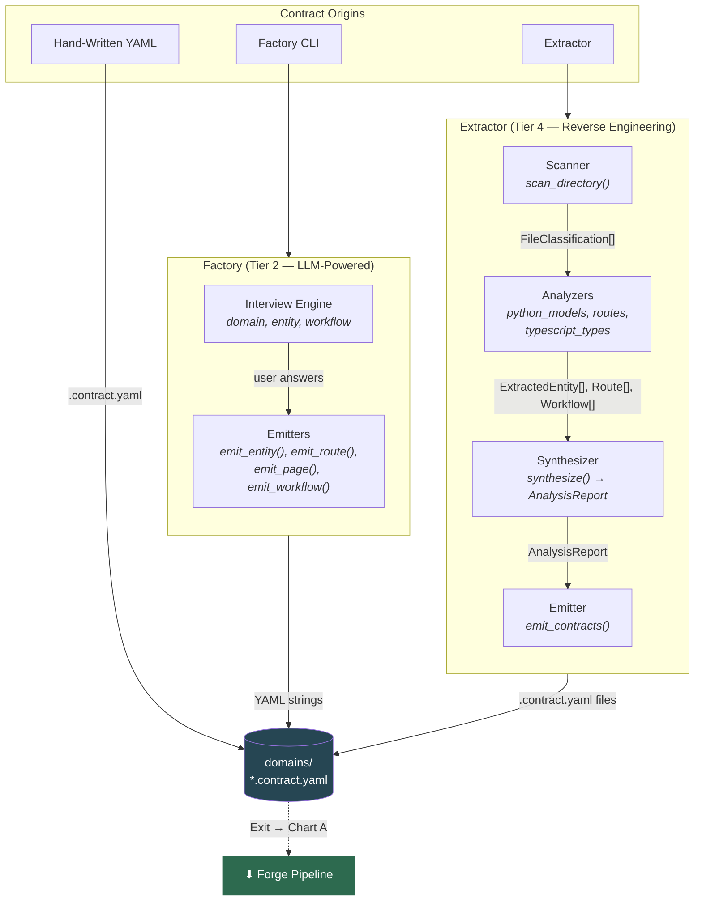
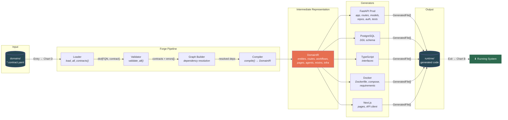
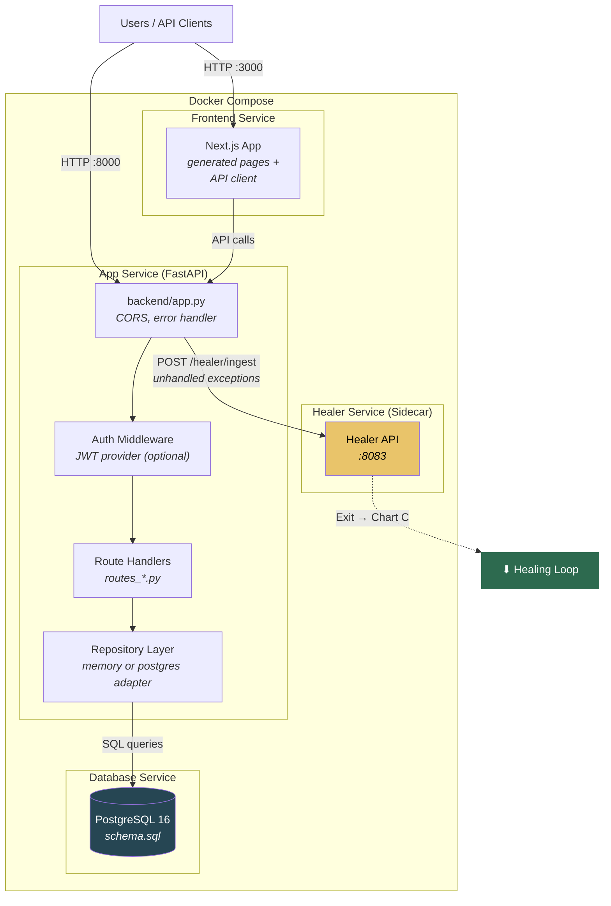
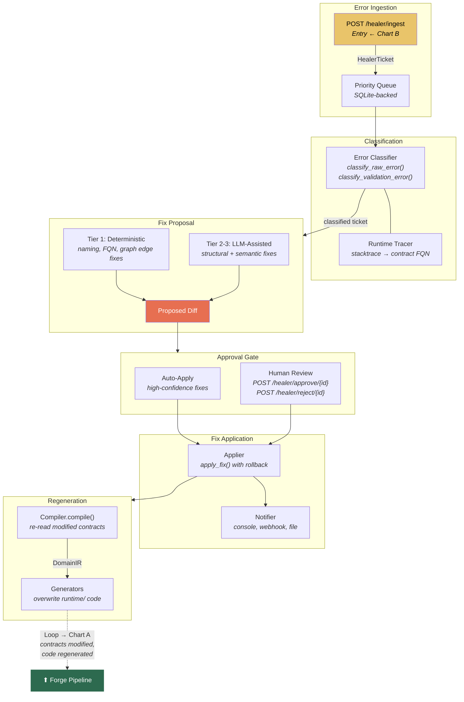
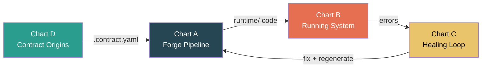

# System Diagrams

Visual maps of Specora Core's architecture, broken into four linked charts. Each chart has labeled entry/exit points that connect to the others.

**Reading order:** D (Contract Origins) -> A (Forge Pipeline) -> B (Running System) -> C (Healing Loop) -> back to A.

---

## Chart D: Contract Origins

How contracts enter the system. All paths produce `.contract.yaml` files that feed into Chart A.

---

## Chart A: The Forge Pipeline (Tier 1)

Deterministic compilation from contracts to generated code. Zero LLM tokens.

---

## Chart B: Running System (Docker Topology)

The generated app running in production. Shows service connections and where errors exit to the healer.

---

## Chart C: The Healing Loop (Tier 3)

Self-healing pipeline. Errors flow in, classified fixes flow out, regeneration loops back to Chart A.

---

## How the Charts Connect

